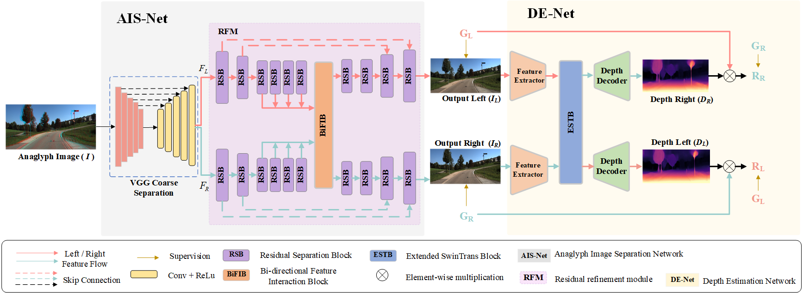
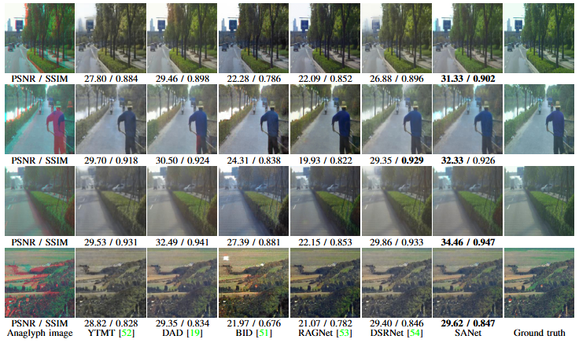

# SANet: An End-to-End Anaglyph Image Separation Network
**Tao Yan, Lu Tan, Jinsheng Liu, and Rynson W.H.Lau**  

**The architecture of our proposed SANet.**

**The results of SANet:**

**Pretrained model: https://pan.baidu.com/s/1PLD-YMIkrMp5X4FvbbCPVA?pwd=mwj3**
**We will release the full code, training scripts, and split files upon acceptance**
